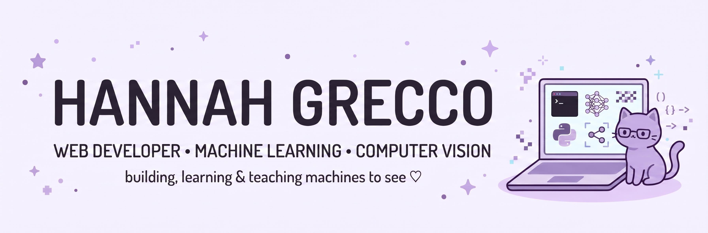

  

## 🐱 About Me

- 💻 **Full Stack Developer (PHP & Laravel)** with a solid background in web development, currently transitioning into **Machine Learning & Computer Vision**.
- 🎓 **Computer Science** undergraduate student.
- 💼 **IT Intern** at the Directorate of Information Technology (DTI) - IFG Rectory.
- 🎯 Actively looking for opportunities (Internships / Junior) in **AI, Machine Learning, and Data Science**.
- 🎧 **Interests:** Passionate about music, gaming, global culture & languages.

---

  
  &nbsp;&nbsp;
  

   
  &nbsp;&nbsp;&nbsp;&nbsp;&nbsp;&nbsp;
   
  &nbsp;&nbsp;&nbsp;&nbsp;&nbsp;&nbsp;
   
  &nbsp;&nbsp;&nbsp;&nbsp;&nbsp;&nbsp;
   
  &nbsp;&nbsp;&nbsp;&nbsp;&nbsp;&nbsp;
  

---

## My Commits

  

---
